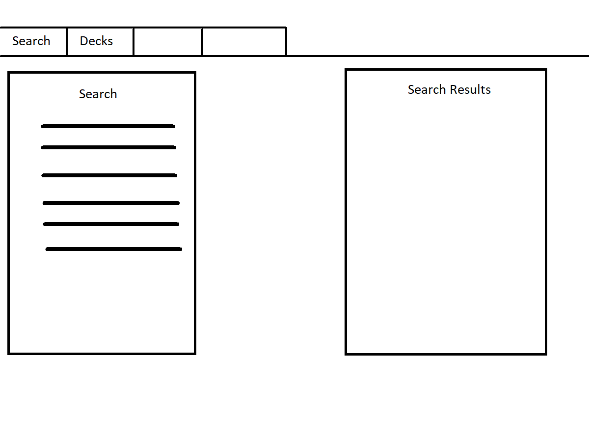

# **MTG Deck Builder**

## **[Website](https://quenmbar.github.io/MTGDeckBuilder/)**

This project creates a web app that interacts with the [magic the gathering api](https://docs.magicthegathering.io/) and allows the user to build persistent decks using a [json-server](https://www.npmjs.com/package/json-server) database. To use this app, you should run `json-server --watch db.json` first to start the database.  Once done, you can use the website to search and filter cards, and add them to various decks.  On the decks tab, you can see a list of the cards in your deck, and can expand each card by clicking on it for more information.  Lastly, from the search tab, you can create random decks of 60 cards.

## **Core Deliverables:**

-   As a User, I can search for cards based on:

    -   Card Name
    -   Color
    -   Mana Cost
    -   Card Type
    -   Power/Toughness
    -   Set
    -   Rarity

-   As a User, when viewing a deck, I can select a card to display all of the card's information

-   As a User, I can create a new deck, add cards to that deck, and review what cards are in that deck

## **Stretch Deliverables**

-   As a user, I can create multiple decks

-   As a user, I can create a random deck

## **Wire Frame**

## Functions

<dl>
<dt><a href="#page">page(direction)</a></dt>
<dd>
Gets the new page of card results

</dd>
<dt><a href="#onFormSubmit">onFormSubmit(e)</a></dt>
<dd>
When the form is submitted, parse the colors selected, then parse the url from the given
inputs and save it globally, and then call to get the page data

</dd>
<dt><a href="#getPageData">getPageData()</a></dt>
<dd>
Using the global url, make an API request to the server

</dd>
<dt><a href="#parseURL">parseURL(name, color, orAnd, manaCost, type, power, toughness, set, rarity)</a></dt>
<dd>
Parses the url from the inputs given by the form.  Saves this new url globally to be used by the fetch

</dd>
<dt><a href="#showCard">showCard(card, table)</a></dt>
<dd>
Creates a row for the card and appends it to the table

</dd>
<dt><a href="#clearSearch">clearSearch()</a></dt>
<dd>
Clears the data from the page

</dd>
<dt><a href="#formatManaCost">formatManaCost(cost)</a> ⇒ <code>HTMLElement</code></dt>
<dd>
Converts the returned mana cost from the api to use the mana images instead of letters

</dd>
<dt><a href="#displayDeckTab">displayDeckTab()</a></dt>
<dd>
Logic for the deck tab.  Should be a callback for when the tab is clicked

</dd>
<dt><a href="#displayMainTab">displayMainTab()</a></dt>
<dd>
Logic for the main tab.  Should be a callback for when the tab is clicked

</dd>
<dt><a href="#enableSingleCollapsible">enableSingleCollapsible(collapse)</a></dt>
<dd>
Logic for the collapsible html elements.  Should be called on the button part
of the element every time one is created

</dd>
<dt><a href="#displayCard">displayCard(cardObj, deckContainer)</a></dt>
<dd>
Uses a card to create the compatibles that populate the deck tab

</dd>
<dt><a href="#displayAllCards">displayAllCards(cardsArray)</a></dt>
<dd>
Uses an array of cards from the database to rewrite the deck tab

</dd>
<dt><a href="#addCardToDeck">addCardToDeck(e)</a></dt>
<dd>
When the add button is pressed, adds the corresponding card to the database,
and then adds it to the deck

</dd>
<dt><a href="#getDeck">getDeck()</a></dt>
<dd>
Gets the main deck from the database and displays it

</dd>
<dt><a href="#removeCard">removeCard(e)</a></dt>
<dd>
Removes a card from the Dom and the database

</dd>
<dt><a href="#newDeckList">newDeckList()</a> ⇒ <code>Promise.&lt;number&gt;</code></dt>
<dd>
Creates a new deck to add cards to.  Makes a pop up for deck name

</dd>
<dt><a href="#displayDeck">displayDeck()</a></dt>
<dd>
Displays a given deck of cards

</dd>
<dt><a href="#buildDeckOption">buildDeckOption(deck)</a></dt>
<dd>
Adds the deck name to the drop down

</dd>
<dt><a href="#createDeckOptions">createDeckOptions()</a></dt>
<dd>
Loads in the deck names for the drop down

</dd>
<dt><a href="#createRandomDeck">createRandomDeck()</a></dt>
<dd>
Creates a random deck of 60 items and saves it to the database.
Sleep is called to not overwhelm the server with rapid post requests.

</dd>
<dt><a href="#sleep">sleep(ms)</a> ⇒ <code>promise</code></dt>
<dd>
Sleeps for the amount of ms specified

</dd>
</dl>

## page(direction)

Gets the new page of card results

**Kind**: global function

| Param     | Type                 | Description                                      |
| --------- | -------------------- | ------------------------------------------------ |
| direction | <code>boolean</code> | True increments the page and false decrements it |

## onFormSubmit(e)

When the form is submitted, parse the colors selected, then parse the url from the given
inputs and save it globally, and then call to get the page data

**Kind**: global function

| Param | Type               |
| ----- | ------------------ |
| e     | <code>Event</code> |

## getPageData()

Using the global url, make an API request to the server

**Kind**: global function

## parseURL(name, color, orAnd, manaCost, type, power, toughness, set, rarity)

Parses the url from the inputs given by the form. Saves this new url globally to be used by the fetch

**Kind**: global function

| Param     | Type                              | Description                                                           |
| --------- | --------------------------------- | --------------------------------------------------------------------- |
| name      | <code>string</code>               |                                                                       |
| color     | <code>Array.&lt;string&gt;</code> | Array of all the colors selected                                      |
| orAnd     | <code>string</code>               | Whether were looking for both or either of the colors. Defaults to or |
| manaCost  | <code>string</code>               |                                                                       |
| type      | <code>string</code>               |                                                                       |
| power     | <code>string</code>               |                                                                       |
| toughness | <code>string</code>               |                                                                       |
| set       | <code>string</code>               |                                                                       |
| rarity    | <code>string</code>               |                                                                       |

## showCard(card, table)

Creates a row for the card and appends it to the table

**Kind**: global function

| Param | Type                          | Description                            |
| ----- | ----------------------------- | -------------------------------------- |
| card  | <code>Object</code>           | A card object gotten from the api call |
| table | <code>HTMLTableElement</code> | The table it is being appended to      |

## clearSearch()

Clears the data from the page

**Kind**: global function

## formatManaCost(cost) ⇒ <code>HTMLElement</code>

Converts the returned mana cost from the api to use the mana images instead of letters

**Kind**: global function
**Returns**: <code>HTMLElement</code> - HTML element with a number or a picture

| Param | Type                | Description               |
| ----- | ------------------- | ------------------------- |
| cost  | <code>string</code> | Mana cost gotten from API |

## displayDeckTab()

Logic for the deck tab. Should be a callback for when the tab is clicked

**Kind**: global function

## displayMainTab()

Logic for the main tab. Should be a callback for when the tab is clicked

**Kind**: global function

## enableSingleCollapsible(collapse)

Logic for the collapsible html elements. Should be called on the button part
of the element every time one is created

**Kind**: global function

| Param    | Type                           | Description                             |
| -------- | ------------------------------ | --------------------------------------- |
| collapse | <code>HTMLButtonElement</code> | Button for the collapsible HTML element |

## displayCard(cardObj, deckContainer)

Uses a card to create the compatibles that populate the deck tab

**Kind**: global function

| Param         | Type                        | Description                    |
| ------------- | --------------------------- | ------------------------------ |
| cardObj       | <code>Object</code>         | Gotten from the local database |
| deckContainer | <code>HTMLDivElement</code> |                                |

## displayAllCards(cardsArray)

Uses an array of cards from the database to rewrite the deck tab

**Kind**: global function

| Param      | Type                              |
| ---------- | --------------------------------- |
| cardsArray | <code>Array.&lt;Object&gt;</code> |

## addCardToDeck(e)

When the add button is pressed, adds the corresponding card to the database,
and then adds it to the deck

**Kind**: global function

| Param | Type               |
| ----- | ------------------ |
| e     | <code>Event</code> |

## getDeck()

Gets the main deck from the database and displays it

**Kind**: global function

## removeCard(e)

Removes a card from the Dom and the database

**Kind**: global function

| Param | Type               |
| ----- | ------------------ |
| e     | <code>Event</code> |

## newDeckList() ⇒ <code>Promise.&lt;number&gt;</code>

Creates a new deck to add cards to. Makes a pop up for deck name

**Kind**: global function
**Returns**: <code>Promise.&lt;number&gt;</code> - Deck ID

## displayDeck()

Displays a given deck of cards

**Kind**: global function

## buildDeckOption(deck)

Adds the deck name to the drop down

**Kind**: global function

| Param     | Type                |
| --------- | ------------------- |
| deck      | <code>Object</code> |
| deck.name | <code>string</code> |

## createDeckOptions()

Loads in the deck names for the drop down

**Kind**: global function

## createRandomDeck()

Creates a random deck of 60 items and saves it to the database.
Sleep is called to not overwhelm the server with rapid post requests.

**Kind**: global function

## sleep(ms) ⇒ <code>promise</code>

Sleeps for the amount of ms specified

**Kind**: global function
**Returns**: <code>promise</code> - When the program is finished

| Param | Type                |
| ----- | ------------------- |
| ms    | <code>number</code> |
